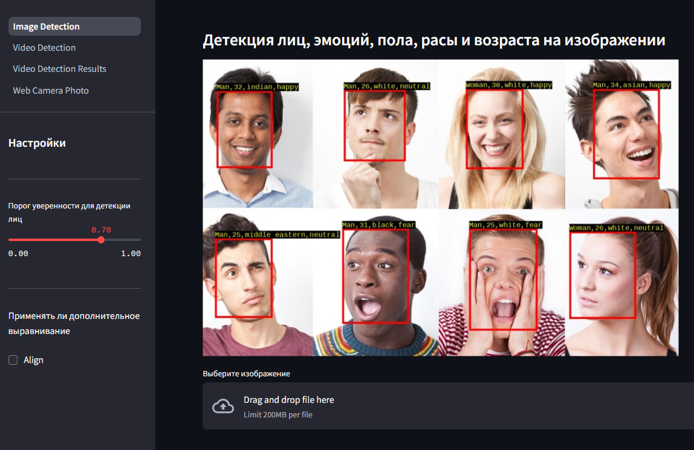
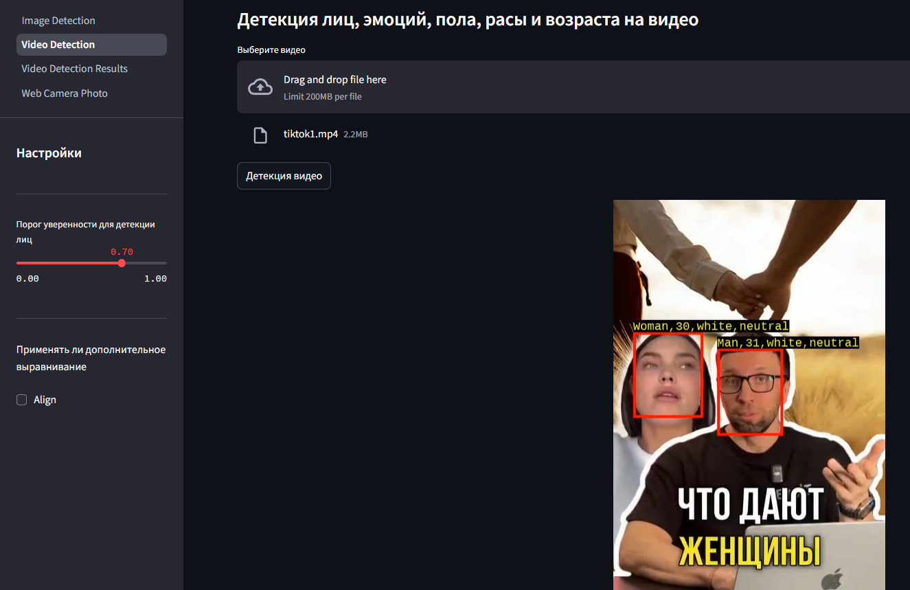
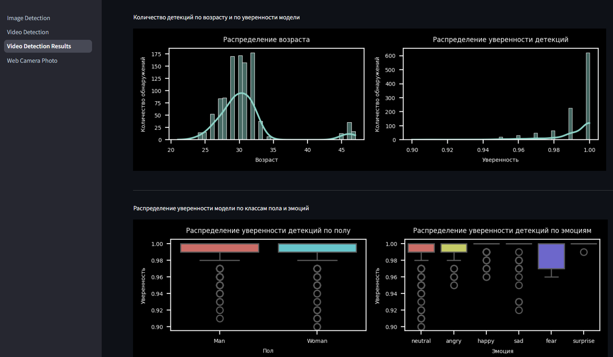

---
# Face, Emotion, Gender, Age, Race Detection with DeepFace and Streamlit

<div align="center">

<a href="https://huggingface.co/spaces/sergey21000/face-detector-deepface"></a>
<a href="https://hub.docker.com/r/sergey21000/face-detector-deepface"></a>
</div>


Детектор эмоций, пола, возраста и расы на фото и видео на основе библиотеки DeepFace и с веб-интрефейсом на Streamlit 

В Google Colab <a href="https://colab.research.google.com/drive/1O32NIhtsJBlR8Y6sp2xOPDOic8xtSnHa"></a> ноутбуке находится код демонстрации возможностей библиотеки DeepFace, демонстрация функционала приложения и отрисовка графиков результатов детекции видео

<details>
<summary>Скриншот страницы детекции изображений</summary>


</details>

<details>
<summary>Скриншот страницы детекции видео</summary>


</details>

<details>
<summary>Скриншот страницы отображения графиков результатов детекции видео</summary>


</details>


---
## 📋 Содержание

- 🚀 [Функционал](#-Функционал)
- 🛠️ [Стек](#-Стек)
- 🐍 [Установка и запуск на Linux через Python](#-Установка-и-запуск-на-Linux-через-Python)
- 🐳 [Установка и запуск через Docker](#-Установка-и-запуск-через-Docker)
  - 🏃‍ [Запуск контейнера из образа Docker HUB](#-Запуск-контейнера-из-образа-Docker-HUB)
  - 🏗️ [Сборка своего образа и запуск контейнера](#-Сборка-своего-образа-и-запуск-контейнера)


---
## 🚀 Функционал
- Детекция лиц и распознавание эмоций, пола, возраста и расы с отрисовкой результата на фото/видео
- Отображение прогресс-бара детекции видео
- Регулировка порога уверенности модели в том что на изображении есть лицо
- Возможность указать параметр дополнительного выравнивания (align) перед детекцией для улучшения качества
- Сохранение результатов детекции видео в файл `csv` с последующей отрисовкой графиков для анализа видео
- Возможность скачать результаты детекции (фото / видео / файл `csv` с аннотациями)
- Детекция фото с веб-камеры и отрисовка результата


---
## 🛠 Стек

- **3.8** <= [python](https://www.python.org/)  <= **3.11**
- [deepface](https://github.com/serengil/deepface) для детекции лиц и распознавания эмоций, пола, возраста и расы
- [Streamlit](https://github.com/streamlit/streamlit) для написания веб-интерфейса
- [ffmpeg](https://ffmpeg.org/) для конвертации видео в отображаемый в браузере формат
- [seaborn](https://github.com/mwaskom/seaborn) для отрисовки графиков результатов детекции видео

Работоспособность приложения проверялась на Ubuntu 22.04 (python 3.10)  
[Документация](https://www.tensorflow.org/install/pip) с командами установки TensorFlow для Windows


---
## 🐍 Установка и запуск на Linux через Python

**1) Клонирование репозитория**  

```
git clone https://github.com/sergey21000/face-detector-deepface.git
cd face-detector-deepface
```

**2) Создание и активация виртуального окружения (опционально)**

```
python3 -m venv env
source env/bin/activate
```

**3) Установка зависимостей**  

- *С поддержкой CPU*
  ```
  pip install -r requirements-cpu.txt
  ```

- *С поддержкой CUDA*
  ```
  pip install -r requirements.txt
  ```

**4) Запуск сервера Streamlit**  
```
streamlit run Image_Detection.py
```

После запуска сервера перейти в браузере по адресу http://localhost:8501/  


---
## 🐳 Установка и запуск через Docker

Для запуска приложения с поддержкой GPU CUDA необходима установка [NVIDIA Container Toolkit](https://docs.nvidia.com/datacenter/cloud-native/container-toolkit/latest/install-guide.html#installation).


### 🏃‍ Запуск контейнера из образа Docker HUB

*С поддержкой CPU и CUDA*
```
docker run -it -p 8501:8501 -v ./models:/app/models sergey21000/face-detector-deepface
```

Данный образ собран на основе образа [tensorflow/tensorflow:2.15.0-gpu](https://hub.docker.com/layers/tensorflow/tensorflow/2.15.0-gpu/images/sha256-66b44c162783bb92ab6f44c1b38bcdfef70af20937089deb7bc20a4f3d7e5491?context=explore)


### 🏗 Сборка своего образа и запуск контейнера

**1) Клонирование репозитория**  

```
git clone https://github.com/sergey21000/face-detector-deepface.git
cd face-detector-deepface
```

**2) Сборка образа и запуск контейнера**

Сборка образа
```
docker build -t face-detector -f Dockerfile .
```

Запуск контейнера

 - *С поддержкой CPU*
  ```
  docker run -it -p 8501:8501 -v ./models:/app/models face-detector
  ```

- *С поддержкой CUDA*
  ```
  docker run -it --gpus all -p 8501:8501 -v ./models:/app/models face-detector
  ```

После запуска сервера перейти в браузере по адресу http://localhost:8501/  

---

Приложение написано для демонстрационных и образовательных целей как любительский проект, оно не предназначалось / не тестировалось для промышленного использования


## Лицензия

Этот проект лицензирован на условиях лицензии [MIT](./LICENSE).
